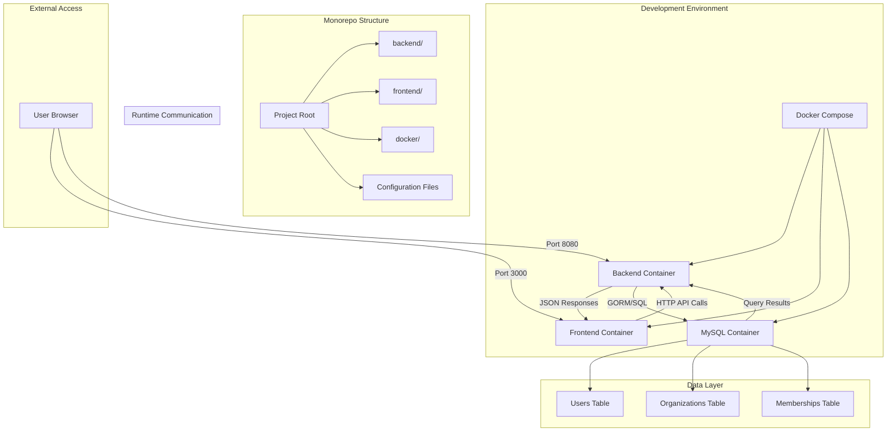

# Design Document: TMember Monorepo

## Overview

TMember is a full-stack web application built using a monorepo architecture that combines a Go backend service with a Vue.js frontend application and MySQL database. The system provides user authentication, organization management, and multi-tenant functionality within a containerized development environment.

The architecture follows modern monorepo best practices by maintaining clear separation between frontend, backend, and database layers while enabling shared tooling and streamlined development processes. The design emphasizes developer experience through consistent tooling, automated builds, seamless service communication, and comprehensive user management capabilities.

## Architecture

The system follows a three-tier architecture with clear separation of concerns between presentation, business logic, and data persistence:



### Key Architectural Decisions

1. **Monorepo Structure**: Single repository containing frontend, backend, and database configurations for coordinated development
2. **Container-First Development**: Docker Compose orchestrates all services including MySQL for consistent development environments
3. **Port Separation**: Frontend (3000), Backend (8080), and Database (3306) run on different ports to avoid conflicts
4. **Hot Reloading**: Both frontend and backend services support live code reloading during development
5. **API-First Communication**: RESTful HTTP API serves as the contract between frontend and backend
6. **Database Persistence**: MySQL provides persistent storage with Docker volumes for data retention
7. **ORM Integration**: GORM handles database operations with automatic migrations and type safety

## Components and Interfaces

### Backend Service (Go)

**Responsibilities:**
- Handle HTTP requests and route them to appropriate handlers
- Process business logic and data validation
- Manage user authentication and session handling
- Perform database operations through GORM
- Return JSON responses to frontend clients
- Provide health check, echo, authentication, and organization management endpoints

**Key Components:**
- HTTP Server (using Gin framework for enhanced routing)
- Authentication middleware for protected routes
- Request handlers for API endpoints (auth, users, organizations)
- GORM models and database operations
- Password hashing and validation utilities
- JSON serialization/deserialization
- CORS middleware for cross-origin requests

**API Interface:**
```go
// Authentication endpoints
POST /api/auth/register
Request: {"email": "string", "password": "string"}
Response: {"user": User, "token": "string"}

POST /api/auth/login
Request: {"email": "string", "password": "string"}
Response: {"user": User, "token": "string"}

// User management endpoints
GET /api/users/me
Response: {"user": User, "organizations": []Organization}

// Organization endpoints
GET /api/organizations
Response: {"organizations": []Organization}

POST /api/organizations
Request: {"name": "string"}
Response: {"organization": Organization}

POST /api/organizations/:id/switch
Response: {"organization": Organization}

// Legacy endpoints
POST /api/echo
Request: {"message": "string"}
Response: {"echo": "string"}

GET /api/health
Response: {"status": "ok"}
```

### Frontend Application (Vue.js + Vite)

**Responsibilities:**
- Render user interface components for authentication and organization management
- Handle user interactions including login, signup, and organization switching
- Make HTTP requests to backend API with authentication tokens
- Display responses and handle error states
- Manage client-side routing and navigation
- Store authentication state and current organization context

**Key Components:**
- Vue.js application with composition API and Vue Router
- Authentication components (LoginForm, SignupForm)
- Organization management components (OrganizationSelector, CreateOrganization)
- Vite build tool for development and production builds
- HTTP client (Axios) with authentication interceptors for backend communication
- Reactive state management (Pinia) for authentication and organization state

**Component Structure:**
```
src/
├── components/
│   ├── auth/
│   │   ├── LoginForm.vue
│   │   └── SignupForm.vue
│   ├── organization/
│   │   ├── OrganizationSelector.vue
│   │   └── CreateOrganization.vue
│   └── EchoForm.vue
├── views/
│   ├── AuthView.vue
│   └── DashboardView.vue
├── stores/
│   ├── auth.js
│   └── organization.js
├── services/
│   └── api.js
├── router/
│   └── index.js
├── App.vue
└── main.js
```

### Database Service (MySQL)

**Responsibilities:**
- Provide persistent storage for user accounts, organizations, and memberships
- Maintain data integrity through foreign key constraints
- Support concurrent access from backend service
- Persist data across container restarts using Docker volumes

**Database Schema:**
```sql
-- Users table
CREATE TABLE users (
    id BIGINT AUTO_INCREMENT PRIMARY KEY,
    email VARCHAR(255) UNIQUE NOT NULL,
    password_hash VARCHAR(255) NOT NULL,
    created_at TIMESTAMP DEFAULT CURRENT_TIMESTAMP,
    updated_at TIMESTAMP DEFAULT CURRENT_TIMESTAMP ON UPDATE CURRENT_TIMESTAMP
);

-- Organizations table  
CREATE TABLE organizations (
    id BIGINT AUTO_INCREMENT PRIMARY KEY,
    name VARCHAR(255) UNIQUE NOT NULL,
    billing_details JSON,
    created_at TIMESTAMP DEFAULT CURRENT_TIMESTAMP,
    updated_at TIMESTAMP DEFAULT CURRENT_TIMESTAMP ON UPDATE CURRENT_TIMESTAMP
);

-- Organization memberships table
CREATE TABLE organization_memberships (
    id BIGINT AUTO_INCREMENT PRIMARY KEY,
    user_id BIGINT NOT NULL,
    organization_id BIGINT NOT NULL,
    role ENUM('admin', 'member') NOT NULL,
    created_at TIMESTAMP DEFAULT CURRENT_TIMESTAMP,
    updated_at TIMESTAMP DEFAULT CURRENT_TIMESTAMP ON UPDATE CURRENT_TIMESTAMP,
    FOREIGN KEY (user_id) REFERENCES users(id) ON DELETE CASCADE,
    FOREIGN KEY (organization_id) REFERENCES organizations(id) ON DELETE CASCADE,
    UNIQUE KEY unique_membership (user_id, organization_id)
);
```

### Docker Environment

**Development Containers:**
- **Backend Container**: Go development environment with hot reloading via Air, GORM database connectivity
- **Frontend Container**: Node.js environment running Vite dev server with authentication routing
- **Database Container**: MySQL 8.0 with persistent volume storage and initialization scripts
- **Network**: Docker Compose network enabling service-to-service communication with DNS resolution

**Configuration Files:**
```
docker/
├── Dockerfile.backend
├── Dockerfile.frontend
├── Dockerfile.mysql
├── docker-compose.yml
└── mysql/
    └── init.sql
```

## Data Models

### User Authentication Models

```go
// Go backend models
type User struct {
    ID           uint   `json:"id" gorm:"primaryKey"`
    Email        string `json:"email" gorm:"uniqueIndex;not null" binding:"required,email"`
    PasswordHash string `json:"-" gorm:"not null"`
    CreatedAt    time.Time `json:"created_at"`
    UpdatedAt    time.Time `json:"updated_at"`
    
    // Associations
    Memberships []OrganizationMembership `json:"memberships,omitempty" gorm:"foreignKey:UserID"`
}

type Organization struct {
    ID             uint   `json:"id" gorm:"primaryKey"`
    Name           string `json:"name" gorm:"uniqueIndex;not null" binding:"required"`
    BillingDetails *json.RawMessage `json:"billing_details" gorm:"type:json"`
    CreatedAt      time.Time `json:"created_at"`
    UpdatedAt      time.Time `json:"updated_at"`
    
    // Associations
    Memberships []OrganizationMembership `json:"memberships,omitempty" gorm:"foreignKey:OrganizationID"`
}

type OrganizationMembership struct {
    ID             uint   `json:"id" gorm:"primaryKey"`
    UserID         uint   `json:"user_id" gorm:"not null"`
    OrganizationID uint   `json:"organization_id" gorm:"not null"`
    Role           string `json:"role" gorm:"type:enum('admin','member');not null" binding:"required,oneof=admin member"`
    CreatedAt      time.Time `json:"created_at"`
    UpdatedAt      time.Time `json:"updated_at"`
    
    // Associations
    User         User         `json:"user,omitempty" gorm:"foreignKey:UserID"`
    Organization Organization `json:"organization,omitempty" gorm:"foreignKey:OrganizationID"`
}

// Authentication request/response models
type RegisterRequest struct {
    Email    string `json:"email" binding:"required,email"`
    Password string `json:"password" binding:"required,min=8"`
}

type LoginRequest struct {
    Email    string `json:"email" binding:"required,email"`
    Password string `json:"password" binding:"required"`
}

type AuthResponse struct {
    User  User   `json:"user"`
    Token string `json:"token"`
}

type CreateOrganizationRequest struct {
    Name string `json:"name" binding:"required"`
}
```

```javascript
// Frontend TypeScript interfaces
interface User {
  id: number;
  email: string;
  created_at: string;
  updated_at: string;
}

interface Organization {
  id: number;
  name: string;
  billing_details?: any;
  created_at: string;
  updated_at: string;
}

interface OrganizationMembership {
  id: number;
  user_id: number;
  organization_id: number;
  role: 'admin' | 'member';
  created_at: string;
  updated_at: string;
  user?: User;
  organization?: Organization;
}

interface RegisterRequest {
  email: string;
  password: string;
}

interface LoginRequest {
  email: string;
  password: string;
}

interface AuthResponse {
  user: User;
  token: string;
}

interface CreateOrganizationRequest {
  name: string;
}
```

### Legacy Echo Models

```go
// Go backend models
type EchoRequest struct {
    Message string `json:"message" binding:"required"`
}

type EchoResponse struct {
    Echo string `json:"echo"`
}

type HealthResponse struct {
    Status string `json:"status"`
}
```

```javascript
// Frontend TypeScript interfaces
interface EchoRequest {
  message: string;
}

interface EchoResponse {
  echo: string;
}

interface ApiError {
  error: string;
  message?: string;
}
```

### Configuration Models

```yaml
# Docker Compose service configuration
services:
  backend:
    build: ./docker/Dockerfile.backend
    ports: ["8080:8080"]
    volumes: ["./backend:/app"]
    environment:
      - DB_HOST=mysql
      - DB_PORT=3306
      - DB_USER=tmember
      - DB_PASSWORD=password
      - DB_NAME=tmember_dev
    depends_on:
      - mysql
    
  frontend:
    build: ./docker/Dockerfile.frontend  
    ports: ["3000:3000"]
    volumes: ["./frontend:/app"]
    
  mysql:
    image: mysql:8.0
    ports: ["3306:3306"]
    environment:
      - MYSQL_ROOT_PASSWORD=rootpassword
      - MYSQL_DATABASE=tmember_dev
      - MYSQL_USER=tmember
      - MYSQL_PASSWORD=password
    volumes:
      - mysql_data:/var/lib/mysql
      - ./docker/mysql/init.sql:/docker-entrypoint-initdb.d/init.sql

volumes:
  mysql_data:
```

## Correctness Properties

*A property is a characteristic or behavior that should hold true across all valid executions of a system—essentially, a formal statement about what the system should do. Properties serve as the bridge between human-readable specifications and machine-verifiable correctness guarantees.*

The following properties define the correctness requirements for the TMember monorepo system including authentication and organization management:

### Legacy Echo Properties

### Property 1: Echo Round-Trip Consistency

*For any* non-empty text input submitted through the frontend interface, the text displayed in the response should be identical to the original input.

**Validates: Requirements 8.3, 8.4, 8.5**

### Property 2: HTTP JSON Response Format

*For any* valid HTTP request to the backend API, the response should contain valid JSON data with appropriate content-type headers.

**Validates: Requirements 3.3**

### Property 3: Error Message Display

*For any* failed API request (network error, server error, invalid input), the frontend should display a user-friendly error message indicating the failure.

**Validates: Requirements 8.6**

### Database and Infrastructure Properties

### Property 4: Database Persistence Across Restarts

*For any* data stored in the database, restarting the database container should preserve all previously stored data.

**Validates: Requirements 9.3**

### Property 5: Database Connection Error Handling

*For any* database connection failure, the backend service should respond with appropriate error messages rather than crashing.

**Validates: Requirements 9.4**

### Authentication Properties

### Property 6: Email Validation and Uniqueness

*For any* user registration attempt, the system should validate email format and prevent duplicate email addresses from being stored.

**Validates: Requirements 10.2, 11.2, 11.4, 11.5**

### Property 7: Password Security and Hashing

*For any* user registration, the system should validate password security criteria and store only hashed passwords, never plaintext.

**Validates: Requirements 10.3, 10.4, 11.3**

### Property 8: User Registration and Record Creation

*For any* valid registration request, the system should create a new user record with unique ID, validated email, and hashed password.

**Validates: Requirements 10.5**

### Property 9: Authentication Session Management

*For any* valid login credentials, the system should create an authenticated session, and for any invalid credentials, the system should reject the login attempt.

**Validates: Requirements 10.6, 10.7**

### Organization Management Properties

### Property 10: Organization Creation and Admin Assignment

*For any* organization creation request with a unique name, the system should create the organization and automatically assign the creator as an admin member.

**Validates: Requirements 12.2, 12.3, 14.3**

### Property 11: Organization Membership and Role Management

*For any* organization membership, the system should correctly specify and validate the user's role as either "admin" or "member".

**Validates: Requirements 13.6, 14.2**

### Property 12: Organization Access Control

*For any* organization access attempt, the system should only allow access to users who are members of that organization.

**Validates: Requirements 14.4**

### Property 13: Organization Listing and Switching

*For any* authenticated user, the system should display only organizations they belong to and allow switching between those organizations.

**Validates: Requirements 13.2, 13.3**

### Property 14: Admin Role Management Permissions

*For any* organization admin, the system should allow them to manage member roles within their organization.

**Validates: Requirements 14.5**

## Error Handling

The system implements comprehensive error handling across all layers including authentication and database operations:

### Backend Error Handling

**Authentication Errors:**
- Invalid email format returns HTTP 400 with validation error
- Weak passwords return HTTP 400 with security requirements
- Duplicate email registration returns HTTP 409 with conflict error
- Invalid login credentials return HTTP 401 with authentication error
- Missing authentication tokens return HTTP 401 with unauthorized error
- Expired or invalid tokens return HTTP 403 with forbidden error

**Database Errors:**
- Database connection failures return HTTP 503 with service unavailable error
- Constraint violations return HTTP 400 with validation error details
- Transaction failures are rolled back with appropriate error responses
- Migration failures are logged and prevent application startup

**Input Validation:**
- Empty or missing required fields return HTTP 400 with descriptive error
- Malformed JSON requests return HTTP 400 with parsing error details
- Invalid organization names return HTTP 400 with validation error
- Server errors return HTTP 500 with generic error message

**Error Response Format:**
```go
type ErrorResponse struct {
    Error   string `json:"error"`
    Message string `json:"message,omitempty"`
    Code    string `json:"code,omitempty"`
}
```

### Frontend Error Handling

**Authentication Errors:**
- Registration failures display specific validation messages
- Login failures display "Invalid email or password" message
- Session expiration redirects to login page with notification
- Network authentication errors display "Authentication service unavailable"

**Organization Management Errors:**
- Duplicate organization names display "Organization name already exists"
- Access denied errors display "You don't have permission to access this organization"
- Organization creation failures display specific error messages
- Organization switching failures display "Failed to switch organization"

**API Communication Errors:**
- Network connectivity issues display "Connection failed" message
- Server errors (5xx) display "Server error occurred" message  
- Client errors (4xx) display specific error message from server response
- Timeout errors display "Request timed out" message

**User Input Validation:**
- Empty email fields show "Email is required" message
- Invalid email format shows "Please enter a valid email address"
- Weak passwords show specific security requirements
- Empty organization names show "Organization name is required"
- Form submission disabled until valid input provided
- Clear error state when user corrects input

### Database Error Handling

**Connection Management:**
- Connection pool exhaustion handled with retry logic
- Database unavailability triggers circuit breaker pattern
- Connection timeouts logged and retried with exponential backoff
- Failed transactions automatically rolled back

**Data Integrity:**
- Foreign key constraint violations return descriptive errors
- Unique constraint violations return conflict errors
- Invalid data types rejected with validation errors
- Orphaned records prevented through proper cascade settings

### Docker Environment Error Handling

**Container Startup:**
- Health checks verify service availability before marking containers ready
- Database initialization scripts handle existing data gracefully
- Dependency ordering ensures database starts before backend attempts connections
- Restart policies handle temporary service failures

**Development Workflow:**
- File watching errors logged but don't crash containers
- Build failures displayed in container logs with clear error messages
- Port conflicts detected and reported with suggested alternatives
- Volume mount issues reported with permission guidance

## Testing Strategy

The testing approach combines unit testing for specific examples with property-based testing for universal correctness validation.

### Property-Based Testing

**Framework:** Go's `testing/quick` package for backend, `fast-check` library for frontend JavaScript/TypeScript

**Test Configuration:**
- Minimum 100 iterations per property test to ensure comprehensive input coverage
- Each property test tagged with format: **Feature: tmember-monorepo, Property {number}: {property_text}**
- Property tests validate universal behaviors across all valid inputs

**Property Test Implementation:**
1. **Echo Round-Trip**: Generate random text inputs, submit via API, verify identical response
2. **JSON Response Format**: Generate various API requests, verify all responses are valid JSON
3. **Error Handling**: Generate invalid inputs and error conditions, verify appropriate error messages

### Unit Testing

**Backend Unit Tests (Go):**
- Test specific API endpoints with known inputs and expected outputs
- Test error conditions with invalid JSON, empty requests, server failures
- Test HTTP middleware functionality (CORS, logging, authentication)
- Integration tests for database connections and external service calls

**Frontend Unit Tests (Vue.js + Vitest):**
- Test Vue component rendering with various props and state
- Test user interaction handlers (form submission, button clicks)
- Test API service functions with mocked responses
- Test error state handling and message display

**Integration Testing:**
- End-to-end tests using Docker Compose environment
- Test complete user workflows from UI interaction to backend response
- Test service startup, health checks, and graceful shutdown
- Test hot reloading and development workflow functionality

### Test Organization

```
backend/
├── handlers/
│   ├── echo_test.go
│   └── health_test.go
├── middleware/
│   └── cors_test.go
└── integration/
    └── api_test.go

frontend/
├── src/
│   ├── components/
│   │   └── EchoForm.test.js
│   └── services/
│       └── api.test.js
└── tests/
    └── e2e/
        └── echo-workflow.test.js
```

**Testing Commands:**
- `make test-backend`: Run all Go tests including property tests
- `make test-frontend`: Run all Vue.js tests including property tests  
- `make test-integration`: Run end-to-end tests in Docker environment
- `make test-all`: Run complete test suite across all components