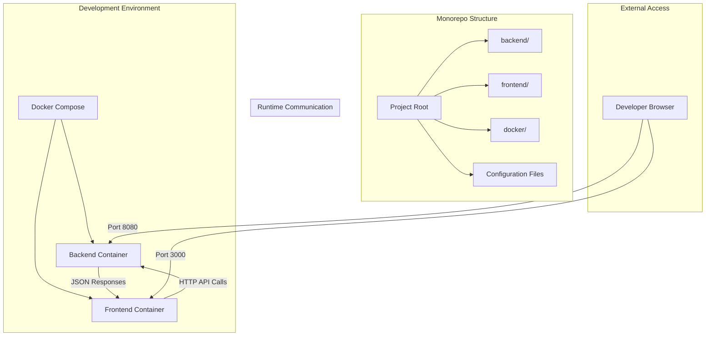

# Design Document: TMember Monorepo

## Overview

TMember is a full-stack web application built using a monorepo architecture that combines a Go backend service with a Vue.js frontend application. The system is designed for efficient development workflows with Docker Compose orchestration, enabling developers to run both services locally with hot reloading capabilities.

The architecture follows modern monorepo best practices by maintaining clear separation between frontend and backend while enabling shared tooling and streamlined development processes. The design emphasizes developer experience through consistent tooling, automated builds, and seamless service communication.

## Architecture

The system follows a client-server architecture with clear separation of concerns:



### Key Architectural Decisions

1. **Monorepo Structure**: Single repository containing both frontend and backend code for easier dependency management and coordinated development
2. **Container-First Development**: Docker Compose orchestrates both services for consistent development environments
3. **Port Separation**: Frontend (3000) and Backend (8080) run on different ports to avoid conflicts
4. **Hot Reloading**: Both services support live code reloading during development
5. **API-First Communication**: RESTful HTTP API serves as the contract between frontend and backend

## Components and Interfaces

### Backend Service (Go)

**Responsibilities:**
- Handle HTTP requests and route them to appropriate handlers
- Process business logic and data validation
- Return JSON responses to frontend clients
- Provide health check and echo endpoints

**Key Components:**
- HTTP Server (using standard library or Gin framework)
- Request handlers for API endpoints
- JSON serialization/deserialization
- CORS middleware for cross-origin requests

**API Interface:**
```go
// Echo endpoint for frontend-backend communication validation
POST /api/echo
Request: {"message": "string"}
Response: {"echo": "string"}

// Health check endpoint
GET /api/health
Response: {"status": "ok"}
```

### Frontend Application (Vue.js + Vite)

**Responsibilities:**
- Render user interface components
- Handle user interactions and form submissions
- Make HTTP requests to backend API
- Display responses and handle error states

**Key Components:**
- Vue.js application with composition API
- Vite build tool for development and production builds
- HTTP client (Axios or Fetch API) for backend communication
- Reactive state management for UI updates

**Component Structure:**
```
src/
├── components/
│   └── EchoForm.vue
├── services/
│   └── api.js
├── App.vue
└── main.js
```

### Docker Environment

**Development Containers:**
- **Backend Container**: Go development environment with hot reloading via Air or Reflex
- **Frontend Container**: Node.js environment running Vite dev server
- **Network**: Docker Compose network enabling service-to-service communication

**Configuration Files:**
```
docker/
├── Dockerfile.backend
├── Dockerfile.frontend
└── docker-compose.yml
```

## Data Models

### Echo Request/Response

The primary data model for validating frontend-backend communication:

```go
// Go backend models
type EchoRequest struct {
    Message string `json:"message" binding:"required"`
}

type EchoResponse struct {
    Echo string `json:"echo"`
}

type HealthResponse struct {
    Status string `json:"status"`
}
```

```javascript
// Frontend TypeScript interfaces
interface EchoRequest {
  message: string;
}

interface EchoResponse {
  echo: string;
}

interface ApiError {
  error: string;
  message?: string;
}
```

### Configuration Models

```yaml
# Docker Compose service configuration
services:
  backend:
    build: ./docker/Dockerfile.backend
    ports: ["8080:8080"]
    volumes: ["./backend:/app"]
    
  frontend:
    build: ./docker/Dockerfile.frontend  
    ports: ["3000:3000"]
    volumes: ["./frontend:/app"]
```

## Correctness Properties

*A property is a characteristic or behavior that should hold true across all valid executions of a system—essentially, a formal statement about what the system should do. Properties serve as the bridge between human-readable specifications and machine-verifiable correctness guarantees.*

The following properties define the correctness requirements for the TMember monorepo system:

### Property 1: Echo Round-Trip Consistency

*For any* non-empty text input submitted through the frontend interface, the text displayed in the response should be identical to the original input.

**Validates: Requirements 8.3, 8.4, 8.5**

### Property 2: HTTP JSON Response Format

*For any* valid HTTP request to the backend API, the response should contain valid JSON data with appropriate content-type headers.

**Validates: Requirements 3.3**

### Property 3: Error Message Display

*For any* failed API request (network error, server error, invalid input), the frontend should display a user-friendly error message indicating the failure.

**Validates: Requirements 8.6**

## Error Handling

The system implements comprehensive error handling across all layers:

### Backend Error Handling

**Input Validation:**
- Empty or missing message fields return HTTP 400 with descriptive error
- Malformed JSON requests return HTTP 400 with parsing error details
- Server errors return HTTP 500 with generic error message

**Error Response Format:**
```go
type ErrorResponse struct {
    Error   string `json:"error"`
    Message string `json:"message,omitempty"`
}
```

### Frontend Error Handling

**API Communication Errors:**
- Network connectivity issues display "Connection failed" message
- Server errors (5xx) display "Server error occurred" message  
- Client errors (4xx) display specific error message from server response
- Timeout errors display "Request timed out" message

**User Input Validation:**
- Empty input fields show inline validation messages
- Form submission disabled until valid input provided
- Clear error state when user corrects input

### Docker Environment Error Handling

**Container Startup:**
- Health checks verify service availability before marking containers ready
- Dependency ordering ensures backend starts before frontend attempts connections
- Restart policies handle temporary service failures

**Development Workflow:**
- File watching errors logged but don't crash containers
- Build failures displayed in container logs with clear error messages
- Port conflicts detected and reported with suggested alternatives

## Testing Strategy

The testing approach combines unit testing for specific examples with property-based testing for universal correctness validation.

### Property-Based Testing

**Framework:** Go's `testing/quick` package for backend, `fast-check` library for frontend JavaScript/TypeScript

**Test Configuration:**
- Minimum 100 iterations per property test to ensure comprehensive input coverage
- Each property test tagged with format: **Feature: tmember-monorepo, Property {number}: {property_text}**
- Property tests validate universal behaviors across all valid inputs

**Property Test Implementation:**
1. **Echo Round-Trip**: Generate random text inputs, submit via API, verify identical response
2. **JSON Response Format**: Generate various API requests, verify all responses are valid JSON
3. **Error Handling**: Generate invalid inputs and error conditions, verify appropriate error messages

### Unit Testing

**Backend Unit Tests (Go):**
- Test specific API endpoints with known inputs and expected outputs
- Test error conditions with invalid JSON, empty requests, server failures
- Test HTTP middleware functionality (CORS, logging, authentication)
- Integration tests for database connections and external service calls

**Frontend Unit Tests (Vue.js + Vitest):**
- Test Vue component rendering with various props and state
- Test user interaction handlers (form submission, button clicks)
- Test API service functions with mocked responses
- Test error state handling and message display

**Integration Testing:**
- End-to-end tests using Docker Compose environment
- Test complete user workflows from UI interaction to backend response
- Test service startup, health checks, and graceful shutdown
- Test hot reloading and development workflow functionality

### Test Organization

```
backend/
├── handlers/
│   ├── echo_test.go
│   └── health_test.go
├── middleware/
│   └── cors_test.go
└── integration/
    └── api_test.go

frontend/
├── src/
│   ├── components/
│   │   └── EchoForm.test.js
│   └── services/
│       └── api.test.js
└── tests/
    └── e2e/
        └── echo-workflow.test.js
```

**Testing Commands:**
- `make test-backend`: Run all Go tests including property tests
- `make test-frontend`: Run all Vue.js tests including property tests  
- `make test-integration`: Run end-to-end tests in Docker environment
- `make test-all`: Run complete test suite across all components